# 基础到进阶1

[TOC]

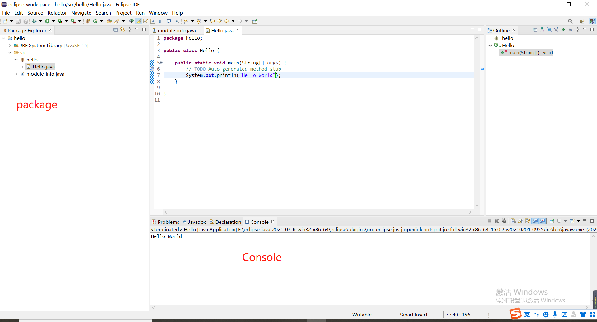

## 1.1 输入

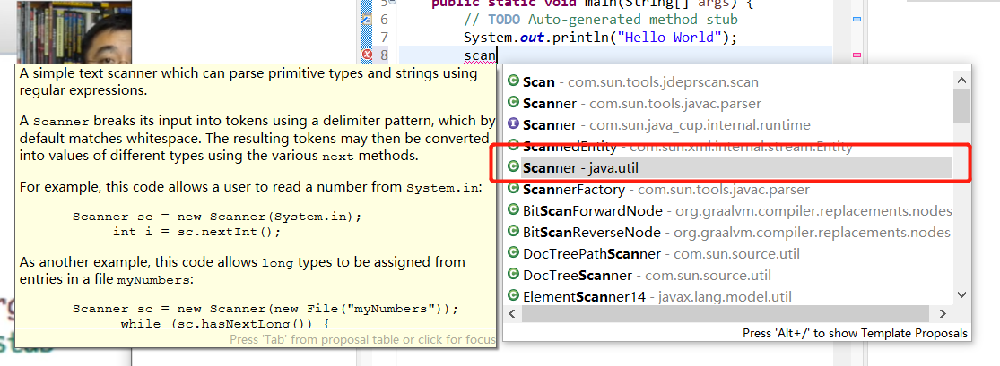

已经结束了——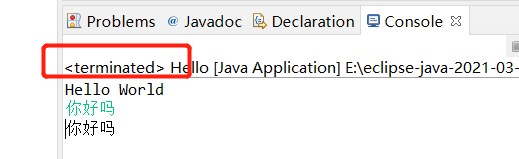

```java
package hello;

import java.util.Scanner;

public class Hello {

	public static void main(String[] args) {
		// TODO Auto-generated method stub
		System.out.println("Hello World");
		Scanner in = new Scanner(System.in);
		//做用户输入
		System.out.println(in.nextLine());
	}
}
```

有两个程序正在运行——

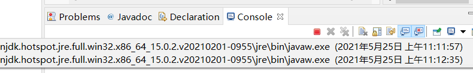

连接另一个字符串——+

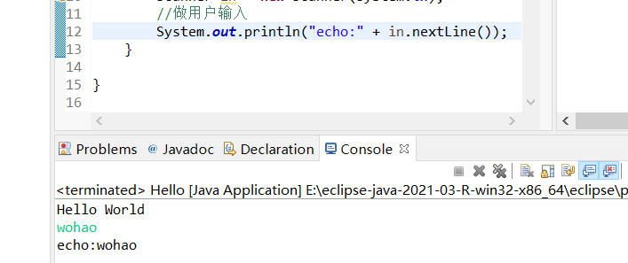

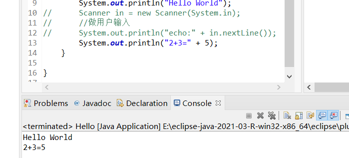

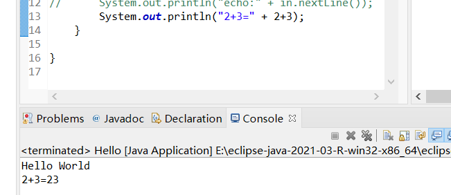

告诉计算机先计算2+3——

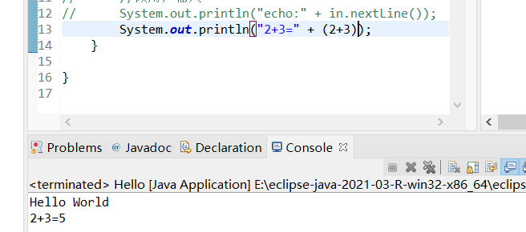

优先级的问题——

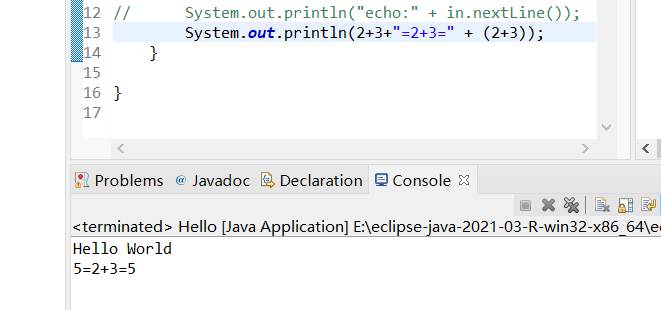


## 1.2 变量

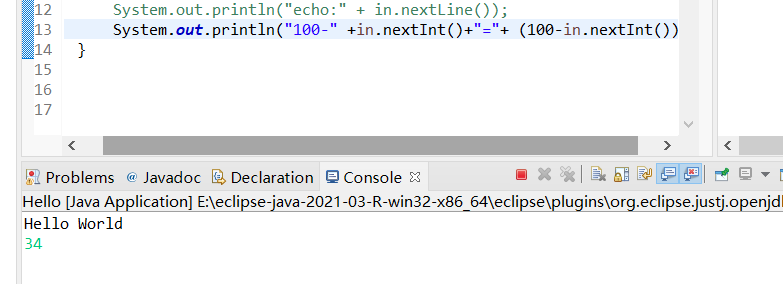

没结果——

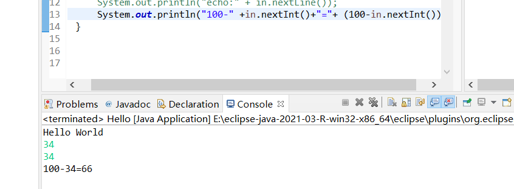

有多少in就要读多少次——

所以要定义变量——可以多次使用

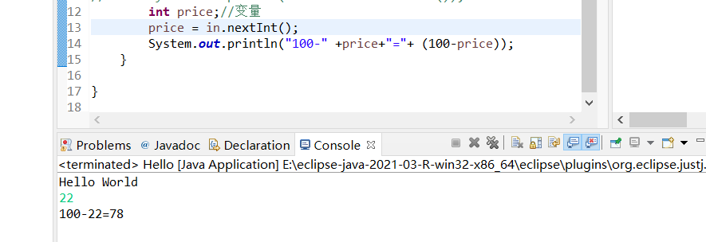

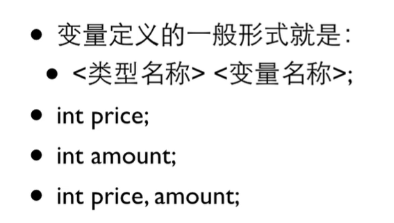

定义之后——类型明确，不可改变——强定义


## 1.3 赋值

初始化——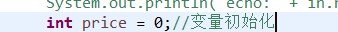

没赋值不能直接使用——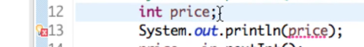

多个变量定义，要一个个赋值——

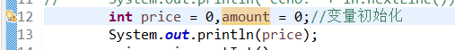

final——常量——

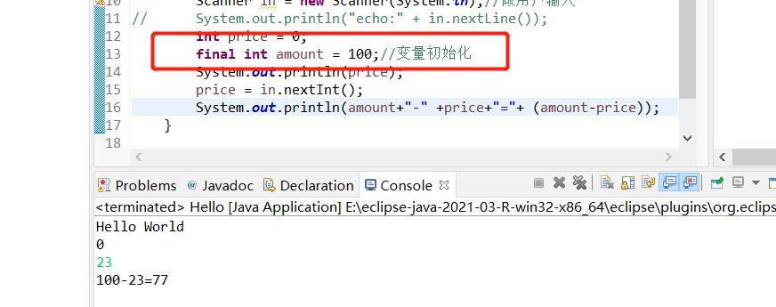

不能再赋值了——

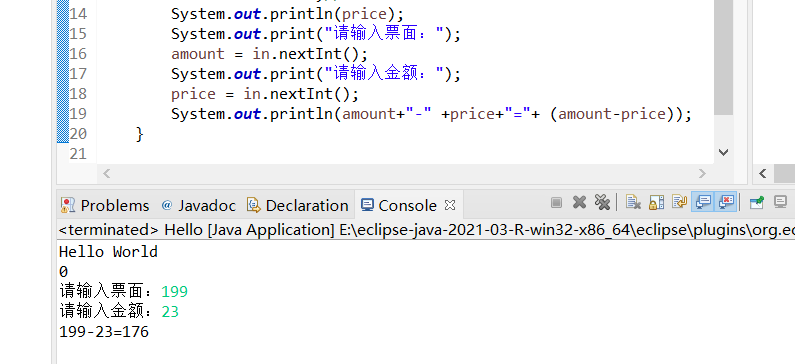

```java
package hello;

import java.util.Scanner;

public class Hello {

	public static void main(String[] args) {
		// TODO Auto-generated method stub
		System.out.println("Hello World");
		Scanner in = new Scanner(System.in);//做用户输入
//		System.out.println("echo:" + in.nextLine());
		int price = 0;
		int amount = 100;//变量初始化
		System.out.println(price);
		System.out.print("请输入票面：");
		amount = in.nextInt();
		System.out.print("请输入金额：");
		price = in.nextInt();
		System.out.println(amount+"-" +price+"="+ (amount-price));
	}
}
```


## 1.4 浮点数

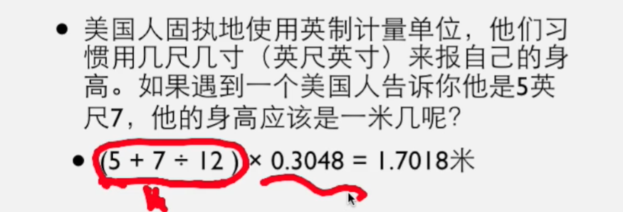

两个整数运算只能是整数——

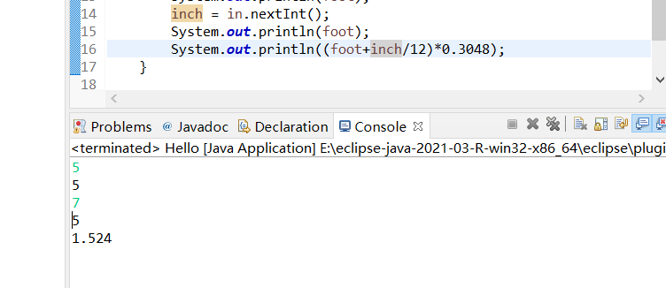

加个小数点就不一样了——上面inch直接整除变成0了，省去了小数部分

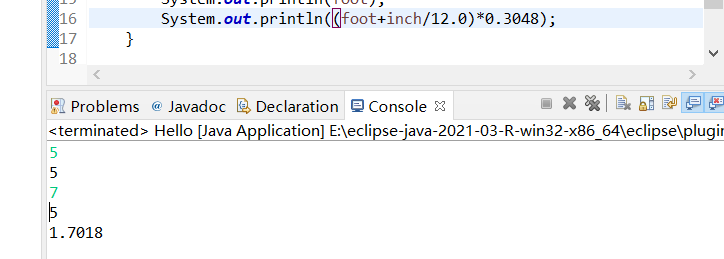

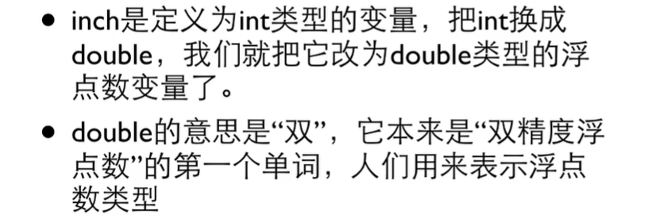

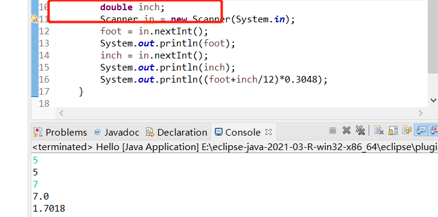

读进去是什么就可以打什么——

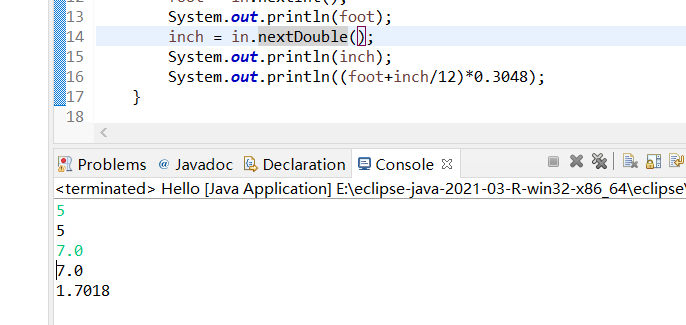

## 1.5 优先级

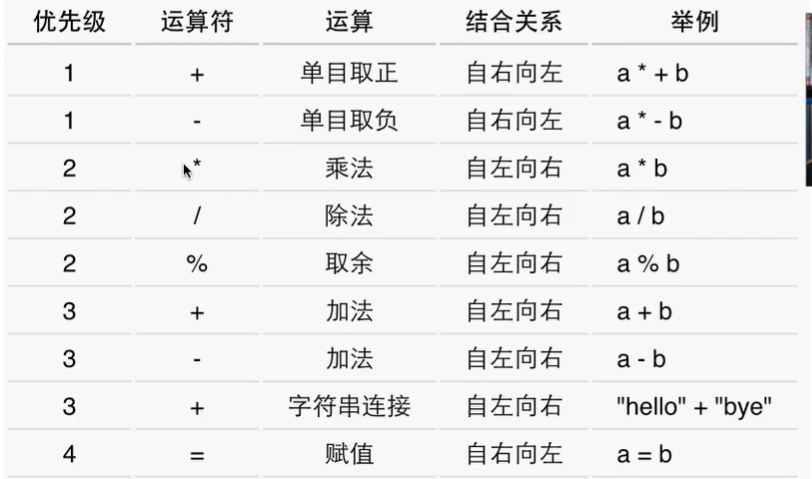

所有单目优先级最高——常识比如-b


## 1.6 类型转换

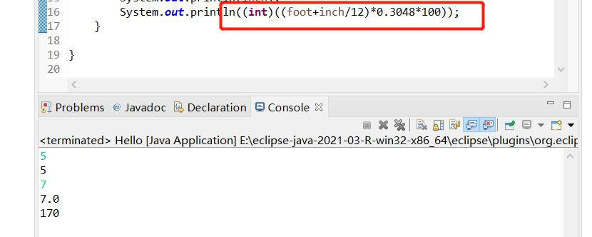

```java
foot = (int)(30/3.0);
```

```java
package hello;

import java.util.Scanner;

public class Hello {

	public static void main(String[] args) {
		// TODO Auto-generated method stub
		int foot;
		foot = (int)(30/3.0);
		double inch;
		Scanner in = new Scanner(System.in);
		foot = in.nextInt();
		System.out.println(foot);
		inch = in.nextInt();
		System.out.println(inch);
		System.out.println((int)((foot+inch/12)*0.3048*100));
	}
}
```

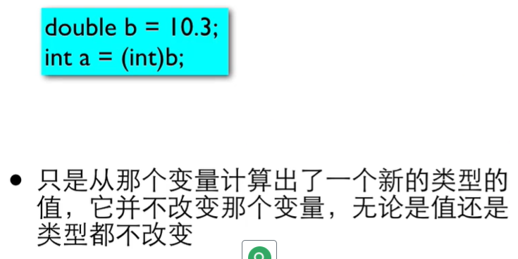

