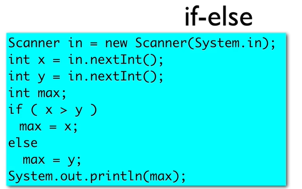
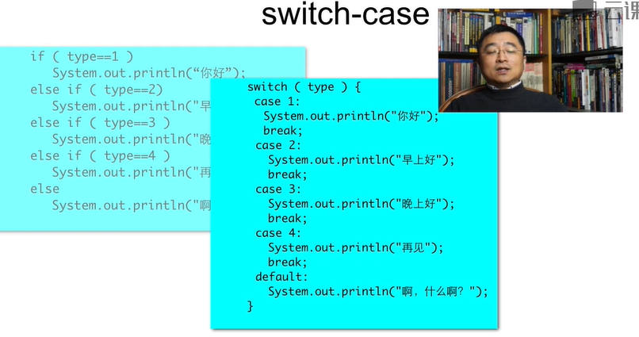
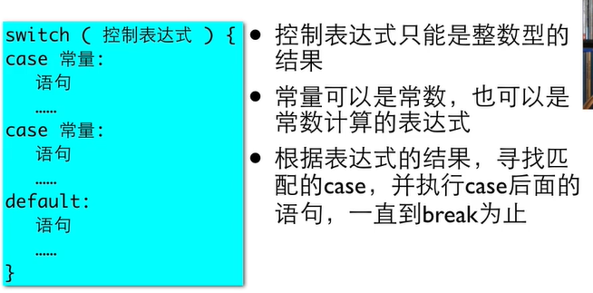

# 基础到进阶2

[TOC]

## 2.1 作比较

```java
package demo01;

import java.util.Scanner;

public class demo01 {

	public static void main(String[] args) {
		// TODO Auto-generated method stub
		Scanner in = new Scanner(System.in);
		
		System.out.print("请投币：");
		int amount = in.nextInt();
		
		System.out.println("****************");
		System.out.println("Java城际铁路专线");
		System.out.println("  无指定座位票  ");
		System.out.println("   票价：10元  ");
		System.out.println("****************");
		
		System.out.println("找零："+(amount-10));
	}
}
```

有问题，没判断钱够不够用——


## 2.2 关系运算


可以相等————比较两个相同的等式

因为浮点运算有误差——所以即使是两个double相比较，数值不同也会FALSE——


因此，判断浮点数是否相等——求差距，是否变成很小的数——


TRUE


### 2.2.1 做判断


```java
package demo01;

import java.util.Scanner;

public class demo01 {

	public static void main(String[] args) {
		// TODO Auto-generated method stub
		Scanner in = new Scanner(System.in);
		
		System.out.print("请投币：");
		int amount = in.nextInt();
		
		System.out.println(amount>=10);
		
		if(amount>10) {
			System.out.println("****************");
			System.out.println("Java城际铁路专线");
			System.out.println("  无指定座位票  ");
			System.out.println("   票价：10元  ");
			System.out.println("****************");
			System.out.println("找零："+(amount-10));
		}

	}

}
```


### 2.2.2 判断语句

```java
package demo01;

import java.util.Scanner;

public class demo001 {

	public static void main(String[] args) {
		// TODO Auto-generated method stub
		final int MINOR = 35;
		
		System.out.print("请输入你的年龄：");
		Scanner in = new Scanner(System.in);
		
		int age = in.nextInt();
		System.out.println("你的年龄是："+age);
		
		if(age<MINOR) {
			System.out.println("年轻是美好的");
		}else {
			System.out.println("年龄决定了你的精神境界，好好珍惜吧");
		}
	}
}
```


#### if-else




```java
package demo01;

import java.util.Scanner;

public class demo002 {

	public static void main(String[] args) {
		// TODO Auto-generated method stub
		Scanner in = new Scanner(System.in);
		int x;
		int y;
		int z;
		System.out.println("请输入三个数：");
		x = in.nextInt();
		y = in.nextInt();
		z = in.nextInt();
		int max = 0;
		if(x>y) {
			if(x>z) {
				max=x;
			}else {
				max=z;
			}
		}else {
			if(y>z) {
				max=y;
			}else {
				max=z;
			}
		}
		System.out.println(max);
	}

}
```


### 2.2.3 嵌套和级联的判断

#### 分段函数（级联）


#### 单一出口


左边更好

### 2.2.4 判断语句常见问题

- 忘了大括号
- 在if后面加分号
- 代码风格


### 2.2.5 多路分支

#### Switch-case





```java
package demo01;

import java.util.Scanner;

public class demo003 {

	public static void main(String[] args) {
		// TODO Auto-generated method stub
		System.out.println("请输入整数：");
		Scanner in = new Scanner(System.in);
		int type = in.nextInt();
		
		switch(type)
		{
		case 1:
		case 2:
			System.out.println("你好");
			break;
		case 3:
			System.out.println("晚上好");
		case 4:
			System.out.println("再见");
			break;
		default:
			System.out.println("啊？你说啥");
			break;
		}
	}

}
```


