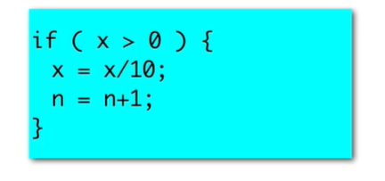

# 基础到进阶3

[TOC]


## 3.1 循环

```java
package demo01;

import java.util.Scanner;

public class demo004 {

	public static void main(String[] args) {
		// TODO Auto-generated method stub
		Scanner in = new Scanner(System.in);
		while(true)
		{
			System.out.print("请投币：");
			int amount = in.nextInt();
			
			System.out.println(amount>=10);
			
			if(amount>10) {
				System.out.println("****************");
				System.out.println("Java城际铁路专线");
				System.out.println("  无指定座位票  ");
				System.out.println("   票价：10元  ");
				System.out.println("****************");
				System.out.println("找零："+(amount-10));
			}
		}


	}

}

```


## 3.2 数数字

3 5 2


如果很多位数呢？

```java
package demo01;

import java.util.Scanner;

public class demo005 {

	public static void main(String[] args) {
		// TODO Auto-generated method stub
		System.out.println("请输入随机数:");
		Scanner in = new Scanner(System.in);
		int number = in.nextInt();
		int count = 0;
		while( number>0 )
		{
			number = number / 10;
			count = count + 1;
		}
		System.out.println(count);
	}

}

```

从右往左数


## 3.3 while循环

```java
package demo01;

import java.util.Scanner;

public class demo004 {

	public static void main(String[] args) {
		// TODO Auto-generated method stub
		Scanner in = new Scanner(System.in);
		int balance = 0;
		while(true)
		{
			System.out.print("请投币：");
			int amount = in.nextInt();
			balance = balance + amount;//累加
			System.out.println(amount>=10);
			
			if(balance>=10) {
				System.out.println("****************");
				System.out.println("Java城际铁路专线");
				System.out.println("  无指定座位票  ");
				System.out.println("   票价：10元  ");
				System.out.println("****************");
				System.out.println("找零："+(balance-10));
				balance = 0;
			}
			else
			{
				
			}
		}


	}

}

```

能够不断循环




做完还会再做

循环体有回上去的箭头——


循环体内要有改变条件的机会

变量表格——


```java
	System.out.println("number="+number+"；count="+count);
```

也可以debug


## 3.4 do-while循环

做完再循环——

```java
		do
		{
			number = number / 10;
			count = count + 1;
			System.out.println("number="+number+";count="+count);
		}while( number>0 );
```


## 3.5 计数循环


```java
package demo02;

import java.util.Scanner;

public class demo021 {

	public static void main(String[] args) {
		// TODO Auto-generated method stub
		Scanner in = new Scanner(System.in);
		int count = 100;
		while(count>0)
		{
			count = count - 1;
			System.out.println(count);//99-0
		}
		System.out.println(count);//0
		System.out.println("发射！");
	}

}

```


```java
		while(count>0)
		{
			System.out.println(count);//100-1
			count = count - 1;
		}
		System.out.println(count);//0
```


## 3.6 算平均数


 

顺序还是很大影响的，先加，才判断，必定多count

```java
package demo02;

import java.util.Scanner;

public class demo022 {

	public static void main(String[] args) {
		// TODO Auto-generated method stub
		Scanner in = new Scanner(System.in);
		int number;
		int sum = 0;
		int count = 0;
		number = in.nextInt();
		while(number!= -1)
		{
			sum = sum + number;
			count = count + 1;
			number = in.nextInt();
		}
		if(count>0) 
		{
			System.out.println("平均数="+ (double)(sum)/count );
		}
		
	}

}

```


## 猜数游戏


```java
package demo02;

import java.util.Scanner;

public class demo023 {

	public static void main(String[] args) {
		// TODO Auto-generated method stub
		Scanner in = new Scanner(System.in);
		int number = (int)(Math.random()*100+1);//[0,1)-->[0,100)-->[1,100]
		int a;
		int count = 0;
		//循环体
		do
		{
			a = in.nextInt();
			count = count +1;
			if(a>number)
			{
				System.out.println("偏大");
			}
			else if(a<number)
			{
				System.out.println("偏小");
			}
		}while(a!=number);
		System.out.println("恭喜你猜对了，你猜了"+count+"次");
	}

}

```


```java
		int number = (int)(Math.random()*100+1);//[0,1)-->[0,100)-->[1,100]
```


## 整数分解


```java
package demo02;

import java.util.Scanner;

public class demo024 {

	public static void main(String[] args) {
		// TODO Auto-generated method stub
		Scanner in = new Scanner(System.in);
		int number;
		number = in.nextInt();
		do
		{
			int digit = number % 10;
			System.out.print(digit);
			number = number / 10;
		}while(number>0);
		System.out.println();
	}

}

```


可以再来个变量

```java
		int result = 0;
		do
		{
			int digit = number % 10;
			result = result*10+digit;
			System.out.print(digit);
			number = number / 10;
		}while(number>0);
		System.out.println();
		System.out.println(result);
	}

```


for可能更优秀
