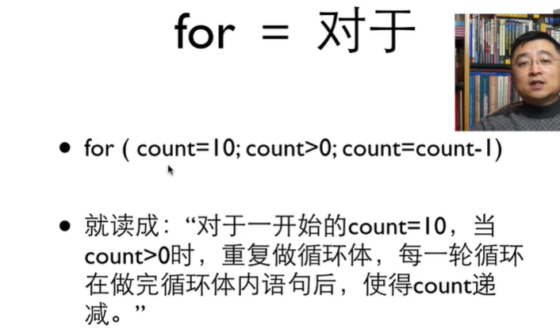
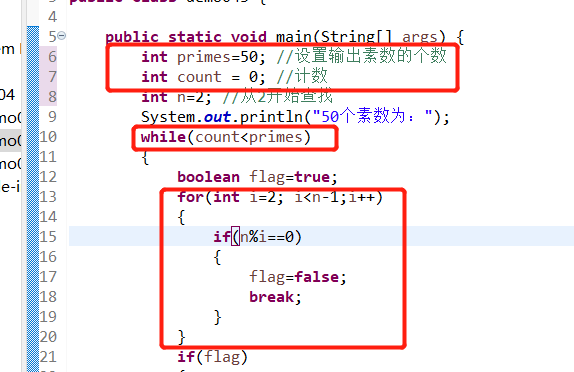
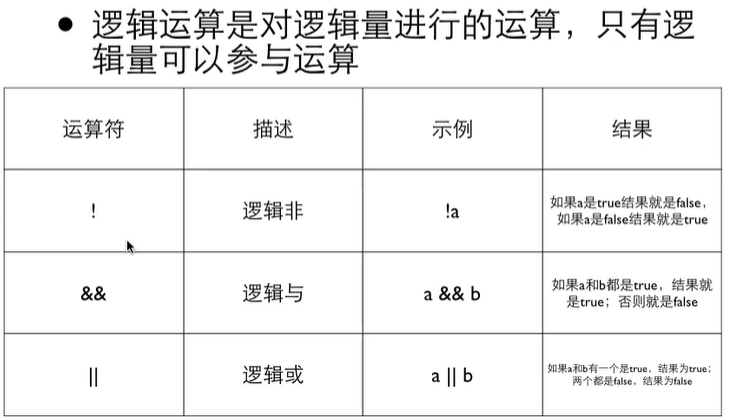

# 基础到进阶4

[TOC]


## 4.1 for循环


需要初始化为1——

```java
package demo04;

import java.util.Scanner;

public class demo041 {

	public static void main(String[] args) {
		// TODO Auto-generated method stub
		Scanner in = new Scanner(System.in);
		int n = in.nextInt();
		int i=1;
		int factor = 1;//初始化阶乘的变量
		while(i<=n)
		{
			factor = factor * i;
			i = i+1;
		}
		System.out.println(factor);
	}

}

```


为什么会负数——


第三个区块——做完循环体之后要做的事情





第一次进for循环之前，做的第一块，所以可以放在里面定义int


## 4.2 复合赋值


要先把右边先算完——再算左边——


前缀后缀——


```java
package demo04;

import java.util.Scanner;

public class demo041 {

	public static void main(String[] args) {
		// TODO Auto-generated method stub
		Scanner in = new Scanner(System.in);
		int n = in.nextInt();
//		int i=1;
		int factor = 1;//初始化阶乘的变量
//		while(i<=n)
//		{
//			factor = factor * i;
//			i = i+1;
//		}
		for( int i=1 ; i<=n ; i++ )
		{
			factor *= i;
		}
		System.out.println(factor);
	}

}

```


### 4.2.1 循环控制

#### 素数


```java
package demo04;

import java.util.Scanner;

public class demo042 {

	public static void main(String[] args) {
		// TODO Auto-generated method stub
		Scanner in = new Scanner(System.in);
		int n = in.nextInt();
		int isPrime=1;
		//14 2/7
		for(int i=2; i<n ; i++)
		{
			if(n%i==0)
			{
				isPrime=0;
				System.out.println(n+"不是素数，i="+i);
			}
		}
		if(isPrime==1)
		{
			System.out.println(n+"是素数");
		}
		else
		{
			System.out.println(n+"不是素数");
		}
	}

}

```


想要跳出循环——


### break VS continue


### 4.2.2 多重循环


```java
package demo04;

import java.util.Scanner;

public class demo042 {

	public static void main(String[] args) {
		// TODO Auto-generated method stub
		Scanner in = new Scanner(System.in);
//		int n = in.nextInt();
		for(int n=2; n<100; n++)
		{
			int isPrime=1;
			//14 2/7
			for(int i=2; i<n ; i++)
			{
				if(n%i==0)
				{
					isPrime=0;
					break;
				}
			}
			if(isPrime==1)
			{
				System.out.print(n+" ");
			}
			else
			{
//				System.out.println(n+"不是素数");
			}
		}

	}

}

```


```java
package demo04;

public class demo043 {

	public static void main(String[] args) {
		int primes=50;
		int count = 0;
		int n=2;
		System.out.println("50个素数为：");
		while(count<primes)
		{
			boolean flag=true;
			for(int i=2; i<n-1;i++)
			{
				if(n%i==0)
				{
					flag=false;
					break;
				}
			}
			if(flag)
			{
				count++;
				if(count % 10 == 0)
				{
					System.out.println(n);
				}
				else
				{
					System.out.print(n + " ");
				}
			}
			n++;
		}
	}
}
```





```java
package demo04;

import java.util.Scanner;

public class demo044 {

	public static void main(String[] args) {
		// TODO Auto-generated method stub
		Scanner in = new Scanner(System.in);
		int amount = in.nextInt();
		for(int one =0; one<=amount; ++one)
		{
			for(int five=0; five<=amount; ++five)
			{
				for(int ten=0; ten<=amount; ++ten)
				{
					for(int twenty=0; twenty<=amount; ++twenty)
					{
						if(one+five*5+ten*10+twenty*20==amount)
						{
							System.out.println(one+"张1元,"+five+"张5元,"+ten+"张10元,"+twenty+"张20元");
							break;
						}
					}
				}
			}
			
		}
	}

}

```

只能break当前for循环——


这个可以——


但是很笨拙——

用标号——


### 4.2.3 逻辑类型

```java
package demo04;

import java.util.Scanner;

public class demo045 {

	public static void main(String[] args) {
		// TODO Auto-generated method stub
		Scanner in = new Scanner(System.in);
		int n1 = in.nextInt();
		boolean isPrime=true;
			for(int i=2; i<n1 ; i++)
			{
				if(n1%i==0)
				{
					isPrime=false;
					break;
				}
			}
			if(isPrime)
			{
				System.out.print(n1+"是素数");
			}
			else
			{
				System.out.println(n1+"不是素数");
			}
		}

}

```





一边逻辑一边数字——无法判断——


因此——

#### 优先级


## 4.3.1 求和


累乘——初始值为1；累加——初始值为0

```java
package demo05;

import java.util.Scanner;

public class demo050 {

	public static void main(String[] args) {
		// TODO Auto-generated method stub
		Scanner in = new Scanner(System.in);
		 int n = in.nextInt();
		 double sum = 0.0;
		 for(int i=1; i<=n; i++)
		 {
			 sum += 1.0/i;
		 }
		 System.out.println(sum);
	}

}

```


```java
		 System.out.printf("%.2f",sum);
```


判断是偶数还是奇数——**对2取余，如果是1就是奇数**


括号里面可以放多个表达式，逗号连接——


或者——


## 4.3.2 最大公约数


for循环里面是继续循环下去的条件——

枚举法——每个整数都是一遍——计算时间长

```java
package demo05;

import java.util.Scanner;

public class demo051 {

	public static void main(String[] args) {
		// 最大公约数
		Scanner in = new Scanner(System.in);
		int a = in.nextInt();
		int b = in.nextInt();
		int gcd = 1;
		for(int i=2; i<=a && i<=b; i++)
		{
			if(a%i==0&&b%i==0)
			{
				gcd=i;
			}
		}
		System.out.println("a和b的最大公约数是"+gcd);
    }
}
```


#### 欧几里得法


```java
package demo05;

import java.util.Scanner;

public class demo052 {

	public static void main(String[] args) {
		// 辗转相除法
		Scanner in = new Scanner(System.in);
		int a = in.nextInt();
		int b = in.nextInt();
		int oa=a;
		int ob=b;
		while(b!=0)
		{
			int r=a%b;
			a=b;
			b=r;
		}
		System.out.println(oa+"和"+ob+"的最大公约数是"+a);
	}

}

```


```java
		while(b!=0)
		{
			int r=a%b;
			System.out.println(a+","+b+","+r);
			a=b;
			b=r;
		}
```


