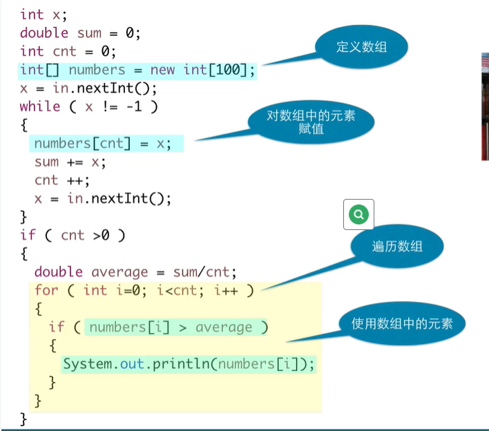
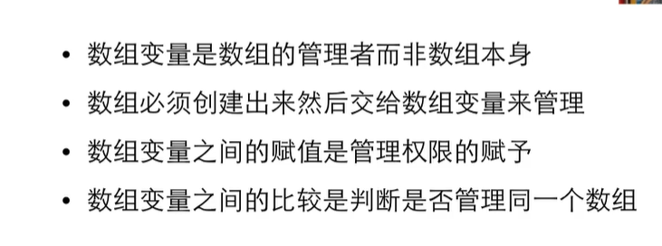
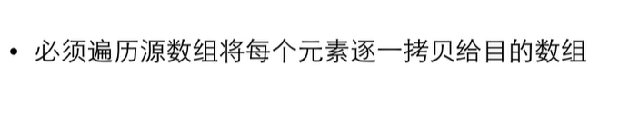
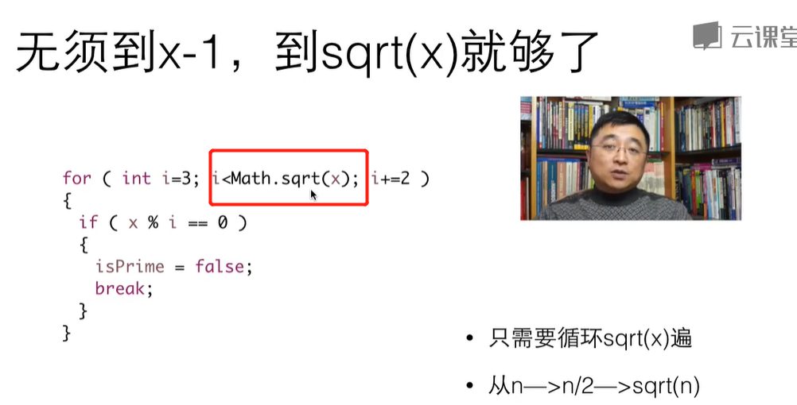

# 基础到进阶5

[TOC]

## 5.1 初试数组


```java
package demo05;

import java.util.Scanner;

public class demo053 {

	public static void main(String[] args) {
		//平均数
		Scanner in = new Scanner(System.in);
		int x;
		double sum=0;
		int cnt=0;
		x= in.nextInt();
		while(x!=-1)
		{
			sum +=x;
			cnt++;
			x=in.nextInt();
		}
		if(cnt>0)
		{
			System.out.println(sum/cnt);
		}

	}

}

```


```java
package demo05;

import java.util.Scanner;

public class demo053 {

	public static void main(String[] args) {
		//平均数
		Scanner in = new Scanner(System.in);
		int x;
		//创建数组
		int[] numbers= new int[100];//记录曾经读进来的数
		double sum=0;
		int cnt=0;
		x= in.nextInt();
		while(x!=-1)
		{
			numbers[cnt]=x;
			//numbers[0]=x;存进去
			sum +=x;
			cnt++;
			x=in.nextInt();
		}
		if(cnt>0)
		{
			double average = sum/cnt;
			for(int i=0; i<cnt; i++)
			{
				if(numbers[i]>average)
				{
					System.out.println(numbers[i]);
				}
			}
			System.out.println(average);

		}

	}

}

```





## 5.2 创建数组


类型不匹配——放不进去——


### 定义数组变量


## 5.3 数组的元素


从0开始编号——


索引——下标

### 有效的下标


```java
package demo05;

import java.util.Scanner;

public class demo053 {

	public static void main(String[] args) {
		//平均数
		Scanner in = new Scanner(System.in);
		double sum=0;
		int cnt=0;
		cnt = in.nextInt();
		if(cnt>0)
		{
			int[] numbers= new int[cnt];//记录曾经读进来的数
			//知道明确地个数了就用for循环
			for(int i=0; i<cnt; i++)
			{
				numbers[i]=in.nextInt();
				sum +=numbers[i];
			}
			double average = sum/cnt;
			for(int i=0; i<cnt; i++)
			{
				if(numbers[i]>average)
				{
					System.out.println(numbers[i]);
				}
			}
			System.out.println(average);
			}
		}
}

```

### 可扩展性


## 5.4 例子 投票统计

```java
package demo06;

import java.util.Scanner;

public class demo060 {

	public static void main(String[] args) {
		// TODO Auto-generated method stub
		Scanner in = new Scanner(System.in);
		int x;
		int[] numbers = new int[10];
		for(int i=0; i<numbers.length; i++)
		{
			System.out.println(numbers[i]);
		}
		x = in.nextInt();
		while(x!=-1)
		{
			if(x>=0&&x<=9)
			{
				numbers[x]++;
			}
			x=in.nextInt();
		}
		for(int i=0; i<numbers.length; i++)
		{
			System.out.println(i+":"+numbers[i]);
		}
	}

}

```


## 5.5 数组变量

### 直接初始化


具有可扩展性——

```java
package demo06;

import java.util.Scanner;

public class demo061 {

	public static void main(String[] args) {
		// TODO Auto-generated method stub
		Scanner in = new Scanner(System.in);
		int[] scores = {87, 98, 69, 54, 65, 76, 87, 99};
		System.out.println(scores.length);
		for(int i=0; i<scores.length; i++)
		{
			System.out.print(scores[i]+" ");
		}
	}
}
```


### 数组变量赋值


为什么跟着变——

#### 管理者&所有者

让两个管理者管理同一个数组——




尽管内容相同——但是管理的不是同一个数组——


### 复制数组




这个时候a和b依旧不是管理同一个数组——

## 5.6 遍历数组


```java
package demo06;

import java.util.Scanner;

public class demo062 {

	public static void main(String[] args) {
		// TODO Auto-generated method stub
		Scanner in = new Scanner(System.in);
		int[] data = {3,2,5,7,4,9,11,34,12,28};
		int x = in.nextInt();
		int loc = -1;//表示没找到
		for(int i=0; i<data.length; i++)
		{
			if(x == data[i])
			{
				loc = i;
				break;
			}
		}
		if(loc>-1)
		{
			System.out.println(x+"是第"+(loc+1)+"个");
		}
		else
		{
			System.out.println(x+"不在里面");
		}
	}
}
```


#### 常见错误


### for-each循环


### 遍历对比


for-each没办法改变原数组，但是可以遍历

## 5.7 素数

算平方根的——



```java
package demo06;

import java.util.Scanner;

public class demo063 {

	public static void main(String[] args) {
		// TODO Auto-generated method stub
		Scanner in = new Scanner(System.in);
		int[] primes = new int[50];
		//将50个素数放入数组里面
		primes[0]=2;
		int cnt=1;//已经多少个素数
		//下一个要放进去累加
		MAIN_LOOP:
		for(int x=3; cnt<50; x++)
		{
			for(int i=0; i<cnt; i++)
			{
				//遍历所有素数
				if(x%primes[i]==0)
				{
					continue MAIN_LOOP;
				}
			}
			primes[cnt++] = x;
		}
		//有了素数表
		for(int k:primes)
		{
			System.out.print(k+" ");
		}
	}
}
```


更快——

100以内的所有素数——


```java
package demo06;

import java.util.Scanner;

public class demo065 {

	public static void main(String[] args) {
		// TODO Auto-generated method stub
		Scanner in = new Scanner(System.in);
		boolean[] isPrime = new boolean[100];
		//boolean初始化都是FALSE
		//自己初始化
		for(int i=0; i<isPrime.length; i++)
		{
			isPrime[i]=true;
		}
		for(int i=2; i<isPrime.length; i++)
		{
			if(isPrime[i])
			{
				for(int k = 2; i*k<isPrime.length; k++)
				{
					isPrime[i*k]=false;
				}
			}
		}
		for(int i=2; i<isPrime.length; i++)
		{
			if(isPrime[i])
			{
				System.out.print(i+" ");
			}
		}
	}
}

```


## 5.8 二维数组


### 遍历


### 初始化


### 游戏


#### 思路


```java
package demo06;

import java.util.Scanner;

public class demo064 {

	public static void main(String[] args) {
		//二维数组
		Scanner in = new Scanner(System.in);
	//来个常量
		final int SIZE =3;
		int[][] board = new int[SIZE][SIZE];
		boolean gotResult = false;
		int numOfX = 0;
		int numOfO = 0;
		
		//读入矩阵
		for(int i=0; i<SIZE; i++)
		{
			for(int j=0; j<SIZE; j++)
			{
				board[i][j] = in.nextInt();
			}
		}
		//检查行
		for(int i=0; i<SIZE; i++)
		{
			numOfX=0;
			numOfO=0;
			for(int j=0; i<SIZE; i++)
			{
				if(board[i][j]==1)
				{
					numOfX++;
				}
				else
				{
					numOfO++;
				}
			}
			if(numOfX==SIZE||numOfO==SIZE)
			{
				gotResult=true;
				break;
			}
		}
		//检查列
		if(!gotResult)
		{
			for(int i=0; i<SIZE; i++)
			{
				numOfX=0;
				numOfO=0;
				for(int j=0; i<SIZE; i++)
				{
					if(board[i][j]==1)
					{
						numOfX++;
					}
					else
					{
						numOfO++;
					}
				}
				if(numOfX==SIZE||numOfO==SIZE)
				{
					gotResult=true;
					break;
				}
			}
		}
		//检查对角线
		if ( !gotResult )
		{
			numOfX = 0;
			numOfO = 0;
			for ( int i=0; i<SIZE; i++ )
			{
				if ( board[i][i] == 1 )
				{
					numOfX ++;
				}
				else
				{
					numOfO ++;
				}
			}
			if ( numOfX == SIZE || numOfO == SIZE )
			{
				gotResult = true;
			}
		}
		//检查反对角线
		if ( !gotResult )
		{
			numOfX = 0;
			numOfO = 0;
			for ( int i=0; i<SIZE; i++ )
			{
				if ( board[i][SIZE-i-1] == 1 )
				{
					numOfX ++;
				}
				else
				{
					numOfO ++;
				}
			}
			if ( numOfX == SIZE || numOfO == SIZE )
			{
				gotResult = true;
			}
		}
		//输出结果
		if ( gotResult )
			{
			if ( numOfX == SIZE )
			{
				System.out.println("X WIN");
			}
			else
			{
				System.out.println("O WIN");
			}
		}
	}

}

```


