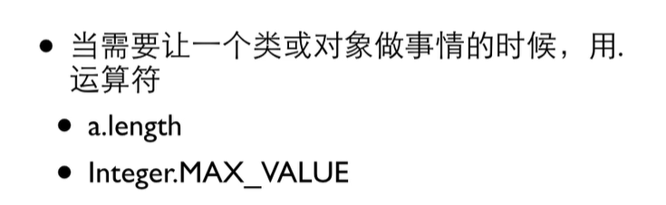
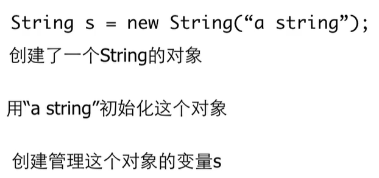
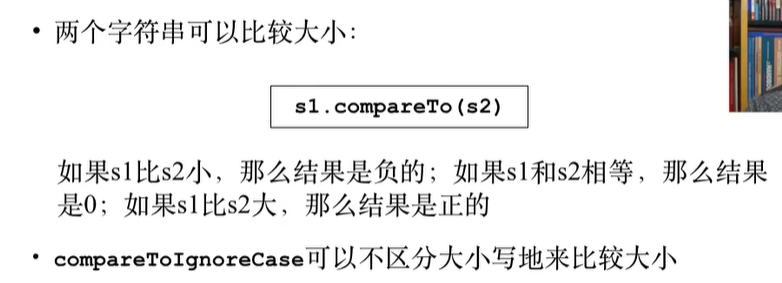

# 基础到进阶6

[TOC]


## 6.1.1 字符类型


UNICODE编码——


减出来是距离——

### 字符大小


## 6.1.2 逃逸字符


回退一格——


## 6.1.3 包裹类型


自然数没有范围


```java
package demo07;

import java.util.Scanner;

public class demo071 {

	public static void main(String[] args) {
		// TODO Auto-generated method stub
		Scanner in = new Scanner(System.in);
		int i =10;
		Integer k =10;
		k=i;
		System.out.println(Integer.MAX_VALUE);
	}

}

```

#### .——运算符



#### 包裹类型的函数——内置


## 6.2.1 字符串变量


包裹类型第一个字母也是大写

#### 第一个字母大写


#### new创建



让s去管理这个字符串变量

#### 初始化


#### 字符串连接


```java
package demo07;

import java.util.Scanner;

public class demo072 {

	public static void main(String[] args) {
		// TODO Auto-generated method stub
		Scanner in = new Scanner(System.in);
		String s = new String("Hello");
		System.out.print(s+12+24);
	}

}
//Hello1224
//从左到右，String相加
```

#### 输入字符串


#### 对象变量的赋值

共同管理——

#### 比较两个String


```java
package demo07;

import java.util.Scanner;

public class demo073 {

	public static void main(String[] args) {
		// TODO Auto-generated method stub
		Scanner in = new Scanner(System.in);
		String s;
		s = in.next();
		System.out.println(s);
		System.out.println(s=="bye");
	}

}
//bye
//bye
//false
//不看内容，看的是对象，是否同一个东西
```


.equals——判断**内容**是否相同

s=="bye"——不看内容，看的是对象，是否**同一个东西**

## 6.2.2 字符串操作


#### 大小的比较



用的是Unicode字符串编码


-1左边小


1左边大


#### 获取长度


#### 访问字符


##### 字符越界


```java
package demo07;

import java.util.Scanner;

public class demo074 {

	public static void main(String[] args) {
		// TODO Auto-generated method stub
		Scanner in = new Scanner(System.in);
		String s1="abc";

		for(int i=0; i<s1.length(); i++)
		{
			System.out.println(s1.charAt(i));
		}
	}

}

```


```java
		for(int i=0; i<s1.length(); i++)
		{
			System.out.println(s1.charAt(i));
		}
```

但是字符串不能用for-each循环 遍历——


只有数组或者可枚举的东西

#### 得到子串


从0开始——

```java
System.out.println(s1.substring(2,4));
System.out.println(s1.substring(2));
```

#### 寻找字符


-1表示没找到


```java
		String s1="0123A563789汉子";
		int loc = s1.indexOf('3');
		System.out.println(s1.indexOf('4'));
		System.out.println(s1.indexOf('A'));
		System.out.println(s1.indexOf("A56"));
		System.out.println(s1.indexOf('3'));
		System.out.println(s1.indexOf('3',loc));
		System.out.println(s1.indexOf('3',loc+1));
```

#### 其他操作


##### 不可变String


```java
		String s1="abcd";
		String s2= s1.toUpperCase();
		System.out.println(s2);
		System.out.println(s1);
```

#### 在Switch-case使用字符串


## 6.2.3 Math类


0-1之间的数


