# 基础到进阶7

[TOC]

## 7.1.1 定义函数


将相同部分提取出来——做成参数——

```java
package demo08;

public class demo080 {
	public static void sum(int a, int b) {
		int i;
		int sum;
		sum=0;
		for ( i=a; i<=b; i++ )
		{
		sum += i;
		}
		System.out.println(a+"到"+b+"的和是"+sum);
	}
	public static void main(String[] args) {
		//代码复制不好——函数
		sum(1,10);
		sum(20,30);
		sum(35,45);
	}

}
//1到10的和是55
//20到30的和是275
//35到45的和是440
```

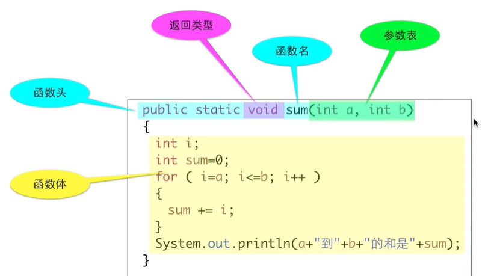

## 7.1.2 调用函数

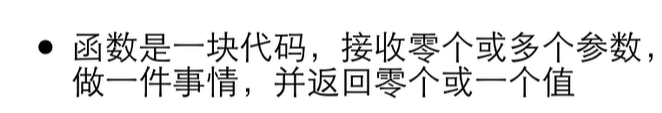

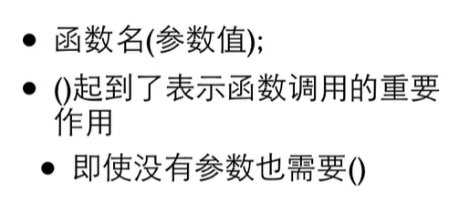

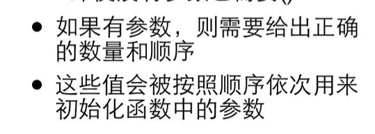

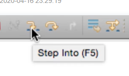

#### 函数返回值

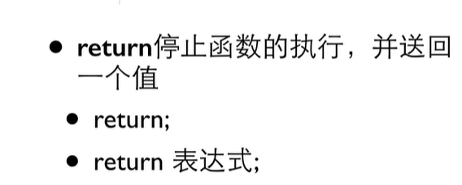

#### max函数

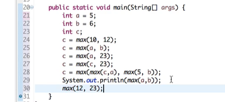

##### 多个出口

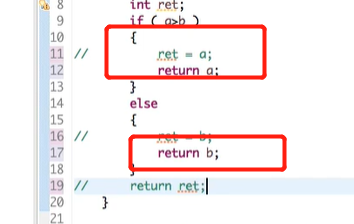

不好

#### void没有返回值的函数

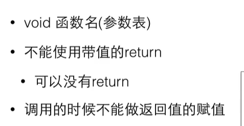


## 7.2.1 参数传递

### 类型不匹配

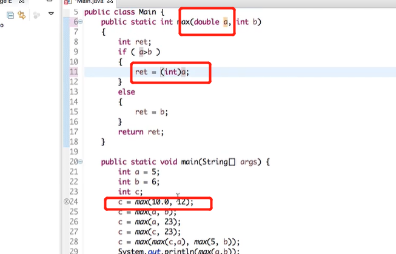

#### 反过来不行

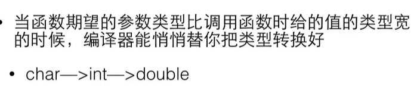

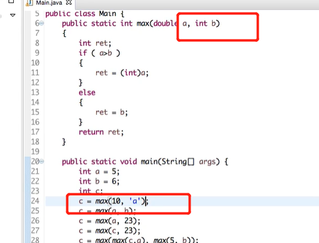

##### 布尔也不行

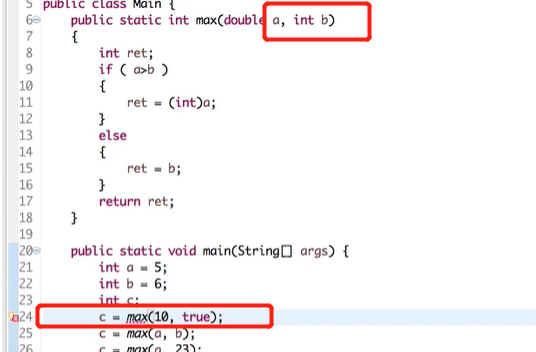

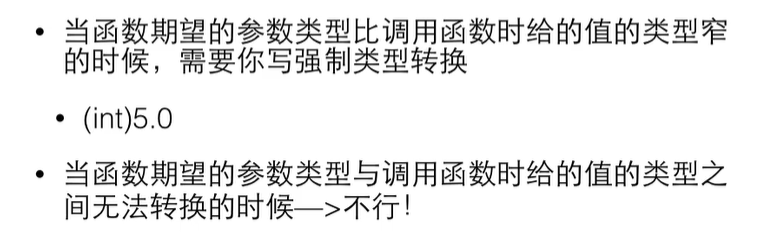

### 传值


#### 形参实参


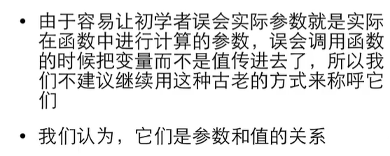


## 7.2.2 本地变量


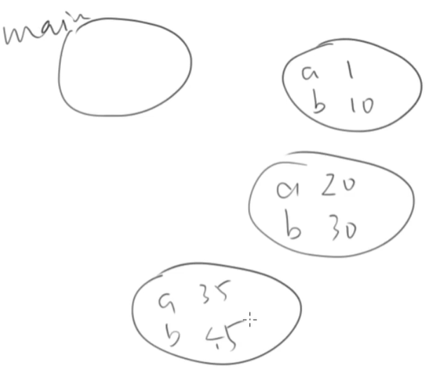

### 递归调用

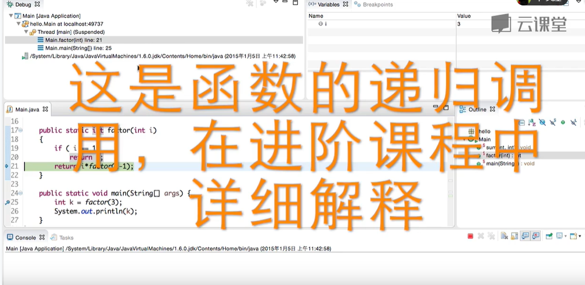

### 生存期和作用域

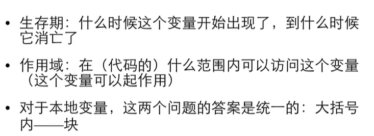

#### 成员变量

#### 本地变量规则

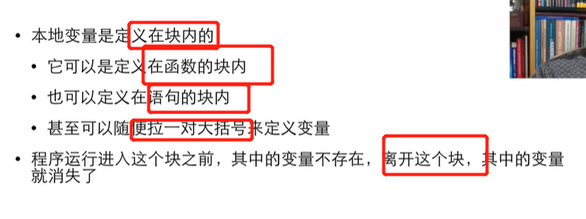

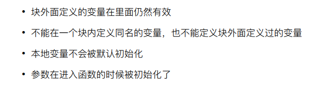


